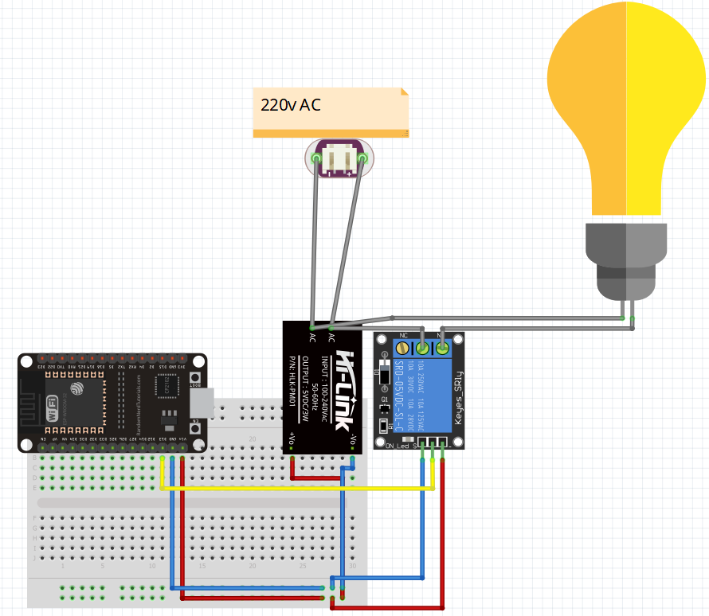

# SigmaHome Microcontroller Example

Contoh kode microcontroller untuk integrasi SigmaHome (Flutter + Firebase) dengan ESP32/ESP8266 dan relay.

---

## Fitur
- Mendukung ESP8266, ESP32, dan semua 32-bit MCU (kecuali Atmel AVR)
- Koneksi ke Firebase Realtime Database menggunakan library FirebaseClient (Mobizt)
- Mendapatkan ID Token secara otomatis dari refresh token (lebih aman)
- Mendukung output boolean (on/off relay)
- Contoh rangkaian tersedia (lihat gambar wiring)

---

## Library yang Dibutuhkan
- [WiFi.h / WiFiClientSecure.h](https://www.arduino.cc/en/Reference/WiFi)
- [FirebaseClient by Mobizt](https://github.com/mobizt/FirebaseClient)
- [ArduinoJson by Benoit Blanchon](https://arduinojson.org/)
- [ArduinoHttpClient by Arduino](https://github.com/arduino-libraries/ArduinoHttpClient)

---

## Cara Pakai

1. **Install semua library di atas** melalui Library Manager Arduino IDE atau PlatformIO.
2. **Ubah konfigurasi berikut di kode:**
   - `WIFI_SSID` dan `WIFI_PASSWORD` sesuai WiFi Anda
   - `API_KEY`, `REFRESH_TOKEN`, dan `DATABASE_URL` didapat dari aplikasi SigmaHome (detail device)
   - `RELAY_PIN` sesuai pin relay yang digunakan
   - Ganti `PATH` pada `DB.get(aClient, "PATH", processData, true);` dengan path device Anda (lihat detail device di aplikasi, biasanya: `user_email_underscore/device_id/device_status`)
3. **Upload kode ke ESP32/ESP8266**
4. **Cek Serial Monitor** untuk status koneksi dan relay
5. **Cek wiring** sesuai gambar berikut:

---

## Penjelasan Kode
- **refreshIdToken()**: Mendapatkan ID Token dari refresh token via HTTP request ke Google Secure Token API
- **processData()**: Mendapatkan status boolean dari database dan mengubah status relay
- **setup()**: Koneksi WiFi, inisialisasi Firebase, dan mulai listen path device
- **loop()**: Menjaga session Firebase tetap aktif

---

## Tips
- Gunakan polling atau listen sesuai kebutuhan (kode ini listen realtime)
- Untuk keamanan lebih, gunakan SSL certificate (lihat dokumentasi FirebaseClient)
- Output hanya boolean (relay ON/OFF)
- Email pada path diganti titik (.) menjadi underscore (_)

---

## Referensi
- [FirebaseClient by Mobizt](https://github.com/mobizt/FirebaseClient)
- [ArduinoJson](https://arduinojson.org/)
- [ArduinoHttpClient](https://github.com/arduino-libraries/ArduinoHttpClient)

---

> Kode dan wiring ini hanya contoh. Pastikan memahami resiko listrik AC sebelum mencoba rangkaian relay!
